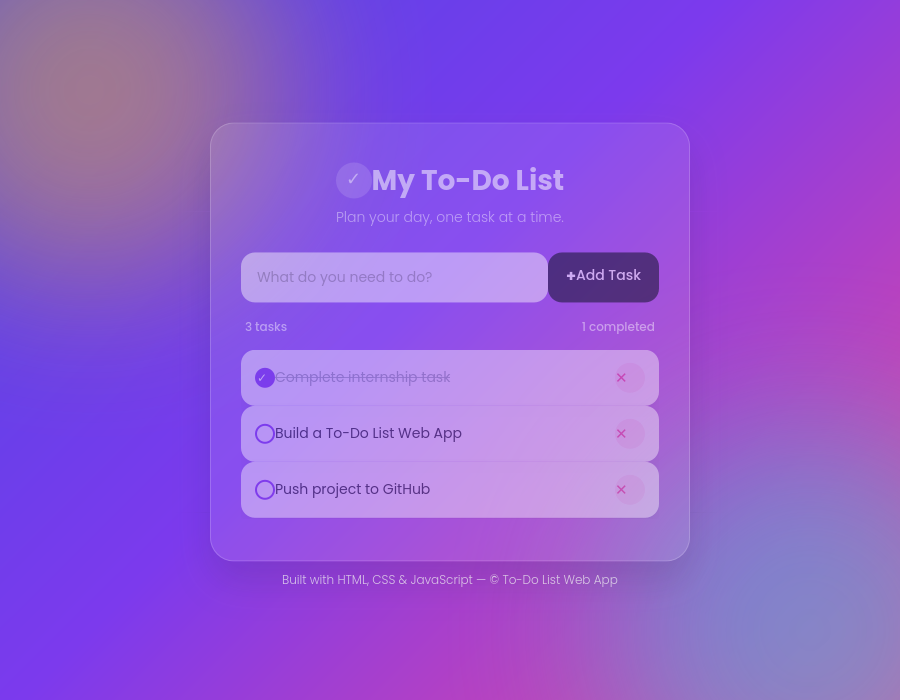

# 📝 To-Do List Web App

A modern, responsive To-Do List web application built entirely with **HTML, CSS, and Vanilla JavaScript** — no frameworks, no libraries, no external APIs. Everything works fully offline.



## 📖 Description

This project is a clean, professional task-management app featuring a glassmorphism card design on a vibrant gradient background. It lets users add, complete, and delete tasks instantly, with all UI updates happening dynamically through DOM manipulation — no page reloads required.

It was built as part of a Web Development Internship task to demonstrate solid fundamentals in HTML, CSS, and JavaScript.

## ✨ Features

- ➕ Add new tasks via button click or by pressing **Enter**
- ❌ Delete any task instantly
- ✅ Mark tasks as completed (with a satisfying line-through effect)
- 🚫 Input validation — empty tasks are blocked with an alert
- 📭 "No tasks available" message shown when the list is empty
- 📊 Live task counter (total tasks / completed tasks)
- ⚡ Instant UI updates — no page refresh needed
- 📱 Fully responsive — looks great on desktop, tablet, and mobile
- 🎨 Modern glassmorphism UI with smooth hover and transition animations

## 🛠️ Technologies Used

- **HTML5** — semantic structure
- **CSS3** — Flexbox, gradients, glassmorphism (`backdrop-filter`), animations, media queries
- **Vanilla JavaScript (ES6)** — DOM manipulation, event listeners, array methods
- **Google Fonts** — [Poppins](https://fonts.google.com/specimen/Poppins)

No frameworks or libraries (no React, Bootstrap, Tailwind, or jQuery) were used.

## 🚀 How to Run

### Option 1: Run Locally
1. Download or clone this repository.
2. Open the `Todo-List-Web-App` folder.
3. Double-click `index.html` to open it in your browser.

That's it — no build steps, no dependencies, no installation required.

### Option 2: Clone via Git
```bash
git clone https://github.com/<your-username>/Todo-List-Web-App.git
cd Todo-List-Web-App
```
Then open `index.html` in your browser.

### Option 3: Deploy on GitHub Pages
1. Push this project to a GitHub repository.
2. Go to **Settings → Pages**.
3. Under "Source," select the `main` branch and `/root` folder.
4. Save — your app will be live at:
   `https://<your-username>.github.io/Todo-List-Web-App/`

## 📁 Folder Structure

```
Todo-List-Web-App/
├── index.html        # Main HTML structure (input, task list, footer)
├── style.css          # Styling: gradient background, glassmorphism, responsive layout
├── script.js          # Vanilla JavaScript logic (add/delete/complete tasks)
├── screenshot.png      # Sample screenshot of the finished app
└── README.md          # Project documentation
```

## 👤 Author

Built as part of a Web Development Internship task.

## 📄 License

This project is free to use for learning and personal portfolio purposes.
